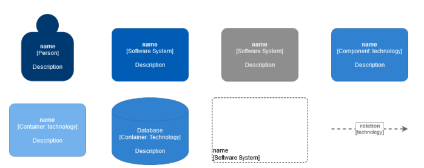
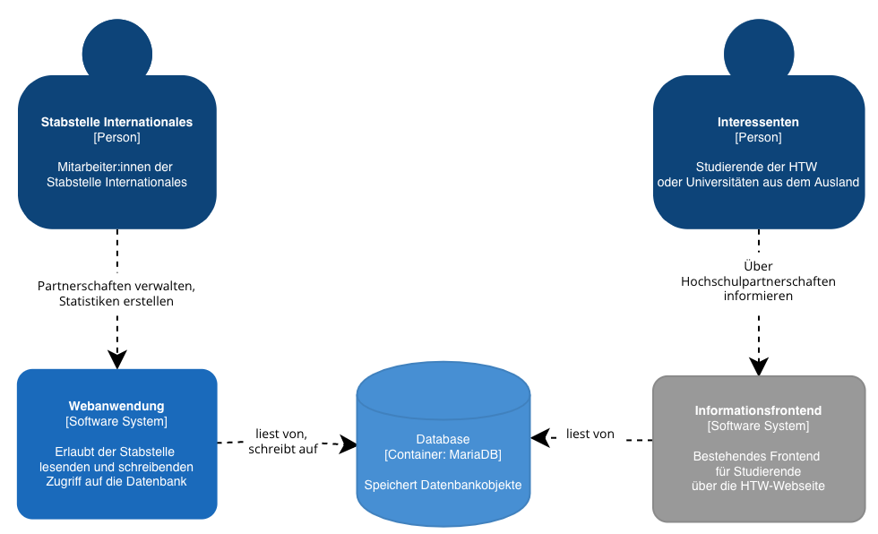
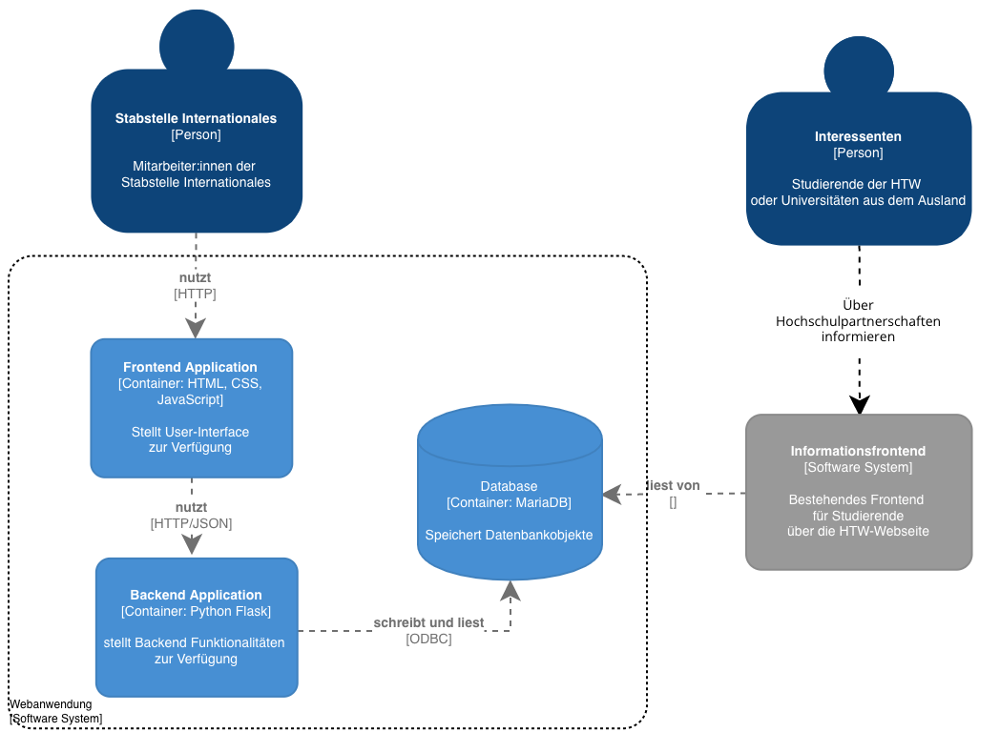
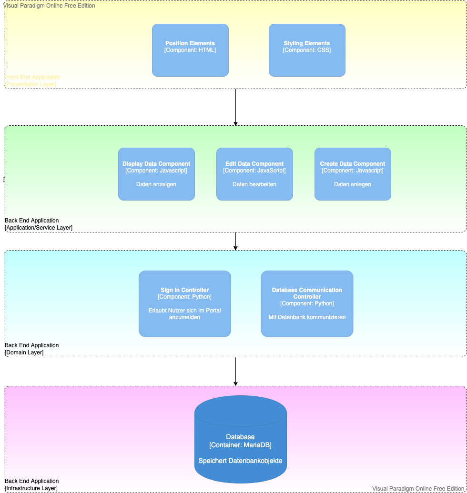
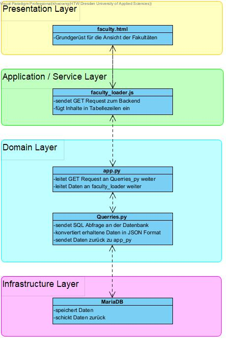
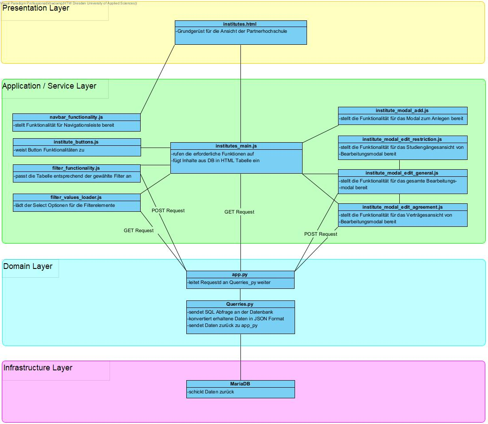

= Architecture Notebook
// Vorname Nachname <email@domain.org>; Vorname2 Nachname2 <email2@domain.org>; Vorname3 Nachname3 <email3@domain.org>
// {localdatetime}
// include::../_includes/default-attributes.inc.adoc[]
// Platzhalter für weitere Dokumenten-Attribute

== Zweck

Dieses Dokument beschreibt die Philosophie, Entscheidungen, Nebenbedingungen, Begründungen, wesentliche Elemente und andere Aspekte des Systems, die Einfluss auf den Entwurf und die Implementierung haben.

//Hinweise: Bearbeiten Sie immer die Abschnitte 2-6 dieser Vorlage. Nachfolgende Abschnitte sind empfohlen, aber optional und sollten je nach Umfang der künftigen Wartungsarbeiten, Fähigkeiten des Entwicklungsteams und Bedeutung anderer architektureller Belange.

//Anmerkung: Die Architektur legt wesentliche EINSCHRÄNKUNGEN für den Systementwurf fest und ist ein Schlüssel für die Erfüllung nicht-funktionaler Eigenschaften!

== Architekturziele und Philosophie

//Hinweise: Beschreiben Sie die Philosophie der Architektur, d.h. den zentralen Ansatz für ihre Architektur. 

//Formulieren Sie eine Reihe von Zielen, die die Architektur in ihrer Struktur und ihrem Verhalten erfüllen muss. 

// Identifizieren Sie kritische Fragen, die von der Architektur adressiert werden müssen, z.B. besondere Hardware-Abhängigkeiten, die vom Rest des Systems isoliert werden sollten oder Sicherstellung der Funktionsfähigkeit unter besonderen Bedingungen (z.B. Offline-Nutzung). Daraus resultierenen Vorschriften bezüglich der Performance. 

Der Zweck des Systems ist das Bereitstellen einer Webanwendung zum Verwalten von Hochschulpartnerschaften und dem Austausch von Studierenden. Benutzer sollten die Anwendung auf Rechnern jeglicher Art (Laptop, Notebook, Desktop-Rechner), außer mobile Endgeräte (Smartphones), im Browser benutzen können.

Die Erreichbarkeit des Systems ist an die Arbeitszeiten der Stabsstelle Internationales gebunden, welche sich auf 8 Stunden, 7-15 Uhr, werktags beschränkt. Außerhalb dieser Zeit besteht keine Verpflichtung für die Erreichbarkeit.

Als Datenbank wird eine bereits bestehende MariaDB genutzt, die vom Rechnerzentrum bereitgestellt wird. Die Software muss also auf der Datenbank aufsetzen und ihre Inhalte an das Frontend kommunizieren.

Das Backend stellt Abfragen an die Datenbank, um Statistiken über die Auslandsaktivitäten zu erstellen, die dann vom Verwaltungsfrontend angezeigt werden.

Das Ziel beim Entwickeln der Architektur war es, eine Brücke zwischen der Webandwendung und der schon bestehenden Datenbank zu schaffen, die sich möglichst gut warten und erweitern lässt. Voraussetzung für die Wartbarkeit und Erweiterbarkeit ist es die Architektur so zu gestalten, dass sie für Menschen möglichst einfach zu verstehen ist und sich gleichzeitig harmonisch in die technischen Bedingungen einfügt. 

== Annahmen und Abhängigkeiten

//[List the assumptions and dependencies that drive architectural decisions. This could include sensitive or critical areas, dependencies on legacy interfaces, the skill and experience of the team, the availability of important resources, and so forth]

=== Annahmen

. Nutzer sind Mitarbeiter der Stabsstelle Internationales
. Nutzer befinden sich, mit einer stabilen Internetverbindung mit genügend Bandbreite und einem modernen Browser, im Netz der HTW Dresden
. Jeder Nutzer benutzt einen HTML5-fähigen Browser und erlaubt JavaScript.
. Unsere eingesetzten Frameworks werden auch in Zukunft unterstützt.
. Wir gehen davon aus, dass die Server der Informatik Fakultät stabil laufen, um sicherzustellen, dass unser Online-Tool stets erreichbar ist.

=== Abhängigkeiten 

. Abhängigkeit vom Rechenzentrum der HTW
.. Unser Server läuft über eine, vom Rechenzentrum bereitgestellte, virtuelle Maschine und muss wochentags von 7-15 Uhr erreichbar sein
.. Die Administration unserer Datenbank erfolgt über das Rechenzentrum, somit muss ein verantwortlicher Mitarbeiter die Verwaltung der Logins übernehmen
. Abhängigkeit von Vorkenntnissen der Teammitglieder
.. Ein Teammitglied hat Vorkenntnisse in der Webentwicklung mittels Python und JavaScript (jQuery)
.. Ein Teammitglied hat Vorkenntnisse in der Webentwicklung mittles HTML, CSS (Bootstrap)
. Abhängigkeit von Funktionsfähigkeit und Pflege der eingesetzten Frameworks und externen Komponenten
.. Die genutzten Frameworks (Flask, jQuery) müssen von Hersteller regelmäßig gepflegt werden.

== Architektur-relevante Anforderungen

//Fügen Sie eine Referenz / Link zu den Anforderungen ein, die implementiert werden müssen, um die Architektur zu erzeugen.

*Funktional*

* SWFA-1: Das System muss alle Informationen zu den Hochschulpartnerschaften speichern.
* SWFA-2: Nur autorisierte Mitarbeiter des Akademischen Auslandsamtes dürfen Zugriff auf das Verwaltungsfrontend haben.

*Zuverlässigkeit*

* NFAR-1: Bei einer Wiederherstellung der Datenbank auf einen Vorzustand muss das Verwaltungsfrontend weiterhin funktionieren.
* NFAR-2: Das Verwaltungsfrontend und das Informationsfrontend müssen parallel auf Daten zugreifen können.
* NFAR-3: Das System muss paralleles Lesen und Schreiben im Verwaltungsfrontend unterstützen. (Multi-User-System)

*Effizienz (Performance)*

* NFAP-1: Der Wechsel zwischen Seiten des Verwaltungsfrontends sollte maximal 3 Sekunden dauern (innerhalb der Hochschule mit funktionierendem Netz)
* NFAP-2: In 90% der Fälle sollen Datenbank relevante Funktionen in 2 Sekunden ausgeführt sein.
* Erweiterbarkeit der Systemfunktionalität

*Benutzbarkeit*

* NFAU-1: Das System sollte sowohl auf großen PC-Monitoren sowie auf kleinen Laptop Bildschirmen bedienbar sein.
* NFAU-2: Das Verwaltungsfrontend sollte auf verschiedenen Betriebssystemen mit unterschiedlichen Browsern laufen.

== Entscheidungen, Nebenbedingungen und Begründungen

//[List the decisions that have been made regarding architectural approaches and the constraints being placed on the way that the developers build the system. These will serve as guidelines for defining architecturally significant parts of the system. Justify each decision or constraint so that developers understand the importance of building the system according to the context created by those decisions and constraints. This may include a list of DOs and DON’Ts to guide the developers in building the system.]

* Nutzung einer Schichtenarchitektur 
** um eine einfache Trennung zwischen Datenverarbeitung, -darstellung und -speicherung zu erhalten
* Verwendung von kostenlosen Bibliotheken (Open Source) und Lizenzen 
=> Grund: dringende Vermeidung von Kosten

//=== Webtechnologien

* Verwendung einer REST-API
** Server und Client Separation => große Flexibilität und individuellen Skalierbarkeit
** Einfache Implementation, da es sich um ein vereinfachtes standardisiertes Format handelt kann die Implementierung stark vereinfacht und beschleunigt werden

Durch das Verwenden der aufgeführten Webtechnologien, möchten wir eine Nutzung ohne Installation bestimmter Tools auf etablierten Browsern ermöglichen. Des Weiteren soll es späteren Arbeitsgruppen möglich sein, das bestehende System problemlos weiterzuentwickeln.

* Erstellung des Verwaltungsfrontends mit HTML / CSS / JavaScript
** Weitverbreitete, allgegenwärtige Technologien zur Webentwicklung
** Vorkenntnisse innerhalb der Gruppe
** Standard bei Webanwendungen
** Leichte Erlernbarkeit und Modularität
** Kein Technologierisiko → wird voraussichtlich lange ein Standard bleiben

//=== Serverseitige Programmierung mit Python

Das Team hat sich für die Programmiersprache Python entschieden, da durch das Framework 'Flask' die serverseitige Programmierung sehr übersichtlich gehalten werden kann. Es ist sehr einfach möglich, die aufrufbaren Seiten innerhalb des Systems zu erweitern. Des Weiteren bestand in Bezug auf Flask innerhalb des Teams vereinzelt Vorerfahrung.

* Verwendung von Python 
** Weniger komplex; für alle Entwickler in gegebener Zeit erlernbar sofern Kompetenz noch
nicht ausreichend
** Python-Skripte laufen auf der bereitgestellten virtuellen Maschiene
** einfache Kommunikation mit MariaDB
** Einbindung der Datenbank einfach möglich durch mysql.connector

// === Datenbank MariaDB 

Die Datenbank musste nicht durch das Team erstellt werden. Das Rechenzentrum der HTW Dresden hat diese bereits für die Vorgruppe innerhalb einer MariaDB bereitgestellt. 

* Verwendung von MariaDB
** Diese bietet einen guten Zugriffsschutz und Backups auf den Servern des Rechenzentrums
** MySQL ähnlich zu MS SQL, mit dem einige Gruppenmitglieder schon Erfahrung haben
** Administration mithilfe von phpMyAdmin
** Erstellung von Datenbankobjekten
** Ändern von Datensätzen außerhalb des Verwaltungsfrontends
// ** Das bestehende Informationsfrontend für die Studierenden läuft ebenfalls auf einer MariaDB Datenbank → einfache Migration

//=== Frameworks

Das Verwenden von Frameworks ist gerade in Gruppen mit wenig Vorerfahrung sehr von Vorteil. Der Code bleibt übersichtlich und die Webentwicklung wird erheblich vereinfacht.

* jQuery (Javascript)
* Flask (Python)

== Architekturmechanismen

// https://www2.htw-dresden.de/~anke/openup/core.tech.common.extend_supp/guidances/concepts/arch_mechanism_2932DFB6.html[Doku "Concept: Architectural Mechanism"]
//[List the architectural mechanisms and describe the current state of each one. Initially, each mechanism may be only name and a brief description. They will evolve until the mechanism is a collaboration or pattern that can be directly applied to some aspect of the design.]

//Beispiele: relationales DBMS, Messaging-Dienste, Transaktionsserver, Webserver, Publish-Subscribe Mechanismus

//Beschreiben Sie den Zweck, Eigenschaften und Funktion der Architekturmechanismen.

=== Sicherheit

Basierend auf dem Prototyp und den Erkenntnissen der Vorgruppe und in Absprache mit dem Rechenzentrum sowie der Stabstelle Internationales, hat das Team die Etnscheidung getroffen den Zugriff auf die Webanwenung dadurch zu schützen, dass sie ausschließlich innerhalb des HTW-Netzwerks zu erreichen ist. 

Des Weiteren darf es nur Mitarbeitern der Stabsstelle Internationales möglich sein, sich im Verwaltungsfrontend anzumelden (SWFA-2).

Der Zugriffschutz auf die Daten der Datenbank wird duch zwei Datenbankaccounts mit jeweils unterschiedlichen Zugriffsrechten gewährleistet. So kann nur einer der beiden Accounts Daten löschen und bearbeiten. Die Unterscheidung der Accounts findet beim Login statt. 

=== Persistente Daten

Die Anforderung SWFA-1 fordert, dass unsere Daten persistent zu speichern sind. Da das Datenbankmodell unverändert bleiben soll, hat das Team dieses übernommen.
Die Entscheidung eine MariaDB zu verwenden wurde ebenfalls von einer der Vorgängergruppen getroffen.
Die Daten werden bei einer validen Anmeldung persistent in der MariaDB gespeichert.

=== Interface

Während der Analyse wurde mit NFAU-1, NFAU-2 festgehalten, dass die unterschiedliche Darstellung der Webseite je nach Nutzer, ein wesentlicher Bestandteil des Projektes ist.
Durch diesen Punkt sind wir auch zu dem Entschluss gekommen, unser Frontend nach dem Schema des responsive Webdesign zu entwerfen.
Die jeweiligen Nutzer verwenden im Laufe der Zeit voraussichtlich unterschiedliche Endgeräte und Bildschirme.
Unsere Webanwendung ist in der Lage, sich den jeweiligen Endgeräten der Nutzer anzupassen.

== Wesentliche Abstraktionen

//[List and briefly describe the key abstractions of the system. This should be a relatively short list of the critical concepts that define the system. The key abstractions will usually translate to the initial analysis classes and important patterns.]

Objekte sind die bereitgestellten Daten. Für eine ausführlichere Auflistung, siehe das Glossar.

• Land: enthält Länderinformationen und die Erasmusverfügbarkeit
• Fakultät: enthält Informationen zu den Fakultäten der Universitäten, die an den Austauschprogrammen teilnehmen, bzw, zu denen eine Partnerschaft mit der HTW Dresden besteht.
• Studienfach: enthält Informationen zu den Studienfächern für die ein Austausch angeboten wird und 1:n Beziehungen zu einer Fakultät
• Hochschule: enthält Kontaktinformationen der Hochschule und ggf einen Erasmuscode
• Mentor: enthält Kontaktinformationen der betreuenden Person des Austauschprogramms
• Hochschulvereinbarung: enthält die Art der Vereinbarung, Länge, Anzahl der
Incomings/Outgoings pro Studienfach und deren maximale Aufenthaltszeit
Dienste verarbeiten die bereitgestellten Daten: Anzeige und Änderung.
Workflows geben die Reihenfolge der Abarbeitung der Dienste an.
Für die Beziehungen zwischen den einzelnen Objekten siehe das Domänenmodel.

== Schichten oder Architektur-Framework

//[Describe the architectural pattern that you will use or how the architecture will be consistent and uniform. This could be a simple reference to an existing or well-known architectural pattern, such as the Layer framework, a reference to a high-level model of the framework, or a description of how the major system components should be put together.]
=== Schichtenarchitektur

Durch die Schichtenarchitektur ist es möglich dem Softwaresystem und den dazugehörigen Bestandteilen feste Aufgabenbereiche zuzuordnen.
Das System wird in logische Schichten aufgeteilt.
Diese sind die Datenbank, das Backend und das Frontend.
Die Datenbank wird den Aspekt des speicherns, bereitstellen und ändern der Daten übernehmen.
Das Frontend wird die Schnittstelle zwischen User und Systemlogik sein, welche sich im Backend befindet.
Dort werden Nutzeranfragen verarbeitet, also die Kommunikation mit der Datenbank vorgenommen.
Dem Frontend werden aber auch, abhängig von der Anfrage, die richtigen Dateien zum Abbilden der HTML-Seiten bereitgestellt.

== Architektursichten (Views)

//[Describe the architectural views that you will use to describe the software architecture. This illustrates the different perspectives that you will make available to review and to document architectural decisions.]
Folgende Sichten auf die Architektur werden empfohlen:

=== Logische Sicht

//Beschreibt die Struktur und das Verhalten Systemteilen, die hohen Einfluss auf die Architektur haben. Dies kann die Paketstruktur, kritische Schnittstellen, wichtige Klassen und Subsysteme sowie die Beziehungen zwischen diesen Elementen enthalten. Zudem sollten die physische und logische Sicht persistenter Daten beschrieben werden, wenn es diesen Aspekt im System gibt. Dies ist ein hier dokumentierter Teilaspekt des Entwurfs

Das nachfolgende C4 Modell (siehe untere Abbildungen) beschreibt die logische Verknüpfung von
Komponenten in unserem System.

==== C4 Modell Legende

.C4 Modell Legende

{nbsp} +

'''

==== C4 Modell Level 1: Kontext

.C4 Modell Level 1: System Context Diagramm

{nbsp} +

'''
==== C4 Modell Level 2: Container Diagramm

.C4 Modell Level 2: Container Diagramm

{nbsp} +

'''
==== C4 Modell Level 3: Components Diagramm

.C4 Modell Level 3: Components Diagramm

{nbsp} +

'''
==== C4 Modell Level 4: Code (Fakultät)

.C4 Modell Level 4: Code

{nbsp} +

==== C4 Modell Level 4: Code (Hochschule)

.C4 Modell Level 4: Code

{nbsp} +

=== Physische Sicht (Betriebssicht)

//Beschreibt die physischen Knoten (Rechner) des Systems, der Prozesse, Threads und Komponenten, die in diesen Knoten ausgeführt werden. Diese Sicht wird nicht benötigt, wenn das System in einem einzelnen Prozess oder Thread ausgeführt wird.
* Das Verwaltungsfrontend wird im Browser des Nutzers ausgeführt.
* Das Backend wird auf dem www2-Server des Rechenzentrums bereitgestellt.
* Die Datenbank läuft auf einem MariaDB-Server des Rechenzentrums.

=== Use Cases

//Eine Liste oder ein Diagramm der Use Cases, die architektur-relevante Anforderungen enthalten.
Im Vergleich zum vollständigen Use-Case-Diagramm fallen hier einige Use-Cases weg, die nicht zur Architektur des Systems beitragen. 

* UC01: In System einloggen / ausloggen
* UC10: Berichte exportieren
